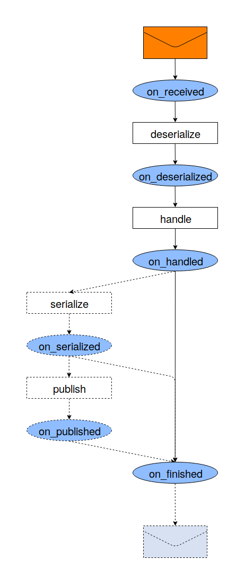
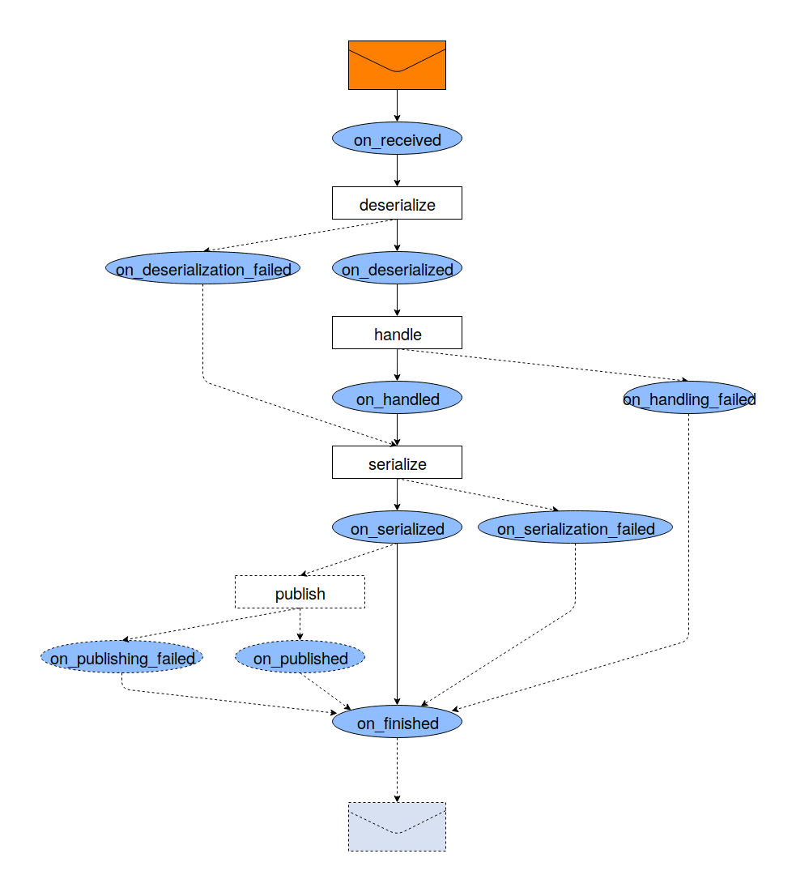
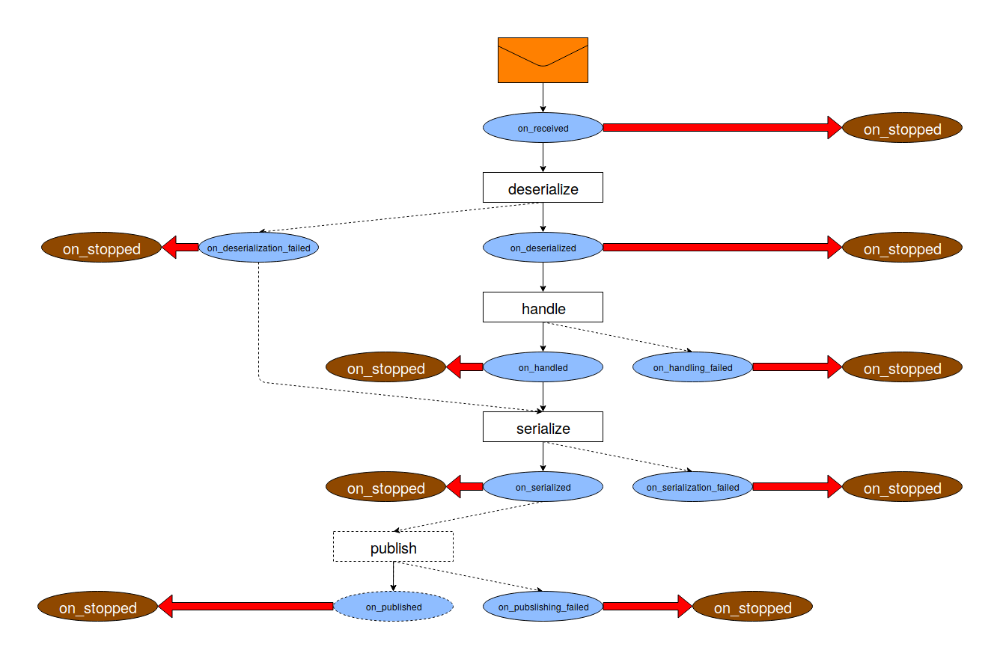

.. _callbacks_section:

Callbacks
=========

Overview
--------

:code:`Executor` (as well as :code:`BaseListener`) provides a rich
pipeline which manages stages, their failures and actions between stages.

A simplified representation of the pipeline (omitting any failures) looks like this:

Deserialization, handling, serialization and publishing are provided
by :ref:`stages_section`.

Each step of the pipeline emits an event which can be handled by the corresponding
callback.
Base classes (:code:`Executor` and :code:`BaseListener`) do nothing but logging inside
their callbacks. You can customize any step by overriding any callback in a child class:

.. code-block:: python

    class MyExecutor(happyly.Executor):

        def on_received(original_message):
            original_message.ack()

        def on_handling_failed(
            self,
            original_message: Any,
            deserialized_message: Mapping[str, Any],
            error: Exception,
        ):
            if isinstance(error, NeedToRetry):
                original_message.nack()

The example above uses :code:`on_handling_failed` which is called whenever
handler raises an exception.
Actually, here's the full picture with failures:

Note that in case deserialization fails, handling is not conducted.
Instead executor tries to get a fallback result via
:code:`Deserializer.build_error_result` and
this result is used instead of the result of handling.

What if I need an emergency stop?
---------------------------------

You can raise :code:`happyly.StopPipeline` inside any callback - and the pipeline will
be stopped immediately.
Well, actually :code:`on_stopped` will be invoked then, as the last resort to finish up.

At the rest of the cases, i.e. if pipeline is not stopped, :code:`on_finished`
is guaranteed to be called at the very end.
