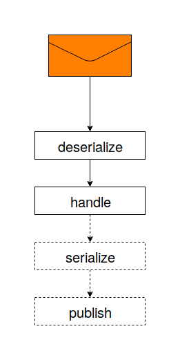

Concepts
========

Handler
-------

*Handler* is the main concept of all Happyly library.
Basically a handler is a callable which implements business logic, and nothing else:

* No serialization/deserialiation here
* No sending stuff over the network
* No message queues' related stuff

Let the handler do its job!

To create a handler you can simply define a function which takes a :code:`dict` as an input
and returns a :code:`dict`:

.. code-block:: python

  def handle_my_stuff(message: dict):
      try
          db.update(message['user'], message['status'])
          return {
              'request_id': message['request_id'],
              'action': 'updated',
          }
      except Exception:
          return {
              'action': 'failed'
          }

Done! This handler can be plugged into your application:
whether it uses Flask or Celery or whatever.

Note that you are allowed to return nothing
if you don't actually need a result from your handler.
This handler is also valid:

.. code-block:: python

  def handle_another_stuff(message: dict):
      try
          neural_net.start_job(message['id'])
          _LOGGER.info('Job created')
      except Exception:
          _LOGGER.warning('Failed to create a job')

If you prefer class-based approach, Happyly can satisfy you too.
Subclass :meth:`happyly.Handler` and implement the following methods:

.. code-block:: python

  class MyHandler(happyly.Handler):

      def handle(message: dict)
          db.update(message['user'], message['status'])
          return {
              'request_id': message['request_id'],
              'action': 'updated',
          }

      def on_handling_failed(message: dict, error)
          return {
              'action': 'failed'
          }

Instance of :code:`MyHandler` is equivalent to :code:`handle_my_stuff`

Executor
--------

To plug a handler into your application you will need :meth:`happyly.Executor`
(or one of its subclasses).

Executor brings the handler into a context of more pipeline steps:

So a typical construction of an Executor looks like this:

.. code-block:: python

  my_executor = Executor(
    deserializer=...
    handler=...
    serializer=...
    publisher=...
  )

Executor implements two crucial methods: :code:`run()`
and :code:`run_for_result()`.
:code:`run(message)` starts an execution pipeline for the provided message.
:code:`run()` returns nothing but can optionally publish a serialized result of
handling.
If you'd like to deal with the result by yourself, use :code:`run_for_result()`
which returns a serialized result of handling.

Executor manages all the stages of the pipeline,
including situation when some stage fails.
But the implementation of any stage itself (deserialization, handling,
serialization, publishing) is provided to a constructor
during executor instantiation.

You can use pre-made implementation of stages provided by Happyly
or create you own (see :ref:`stages_section`)
